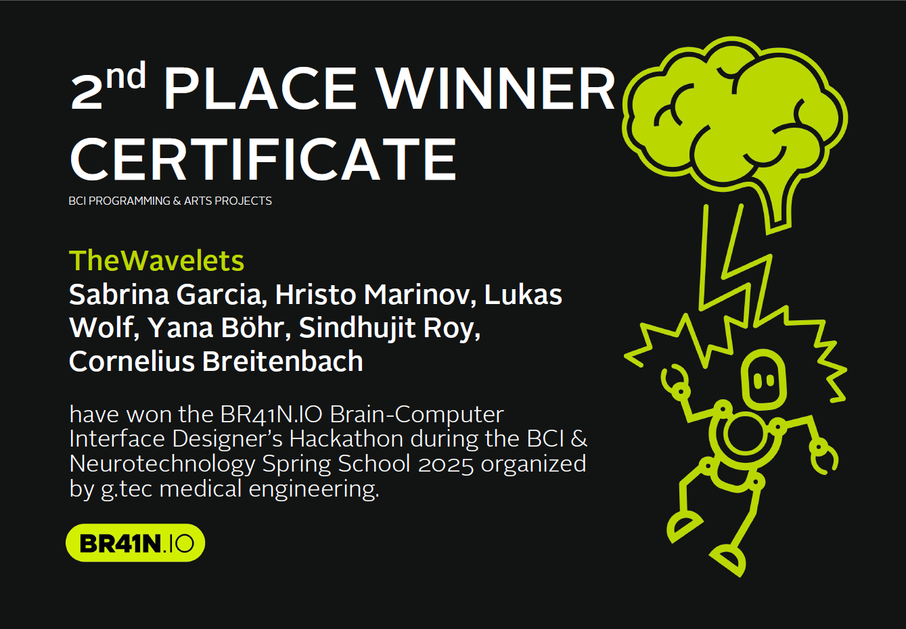

# EEG-to-Music
## A Real-Time Brain-Computer Interface for Generative Composition

This project implements a brain-computer interface (BCI) that translates real-time EEG signals into music by mapping neural features to generative audio prompts. The system was developed during the 2025 Spring School BR41N.IO BCI Hackathon, organized by g.tec medical engineering GmbH, where it was awarded **2nd place**.

It enables hands-free music composition by classifying mental states such as relaxation, concentration, and emotional arousal from multichannel EEG data, and converting those into structured musical parameters.


---

## Overview

The system processes 8-channel EEG data in real time to extract spectral features using fast Fourier transform (FFT) and entropy-based metrics. Based on these features, it classifies mental states and formulates corresponding music prompts. These prompts are submitted to a **publicly hosted instance of MusicGen**, a generative audio interface, where music is created and played back.

This pipeline provides an interactive and personalized form of music composition using only brain signals.

---

## Presentation Materials

* **[Presentation Slides (PDF)](./presentation_slides.pdf)**
* **[Presentation Video (MP4)](./presentation_video.mp4)**

---

## System Features

**1. Real-Time EEG Processing**

* Sampling rate: 250 Hz
* Frequency bands analyzed:

  * Theta (4–7 Hz): relaxation and meditation
  * Alpha (8–12 Hz): calm alertness
  * Beta (13–30 Hz): active concentration or stress
  * Gamma (30–50 Hz): emotional arousal

**2. Mental State Detection**

* Band power ratios (e.g., theta/beta)
* Frontal alpha asymmetry (C3 vs C4)
* Gamma coherence (PO7 vs PO8)
* Cz entropy (signal complexity)

**3. Music Prompt Generation**

* Music parameters inferred from classified mental state include:

  * Genre (Ambient, Jazz, Classical, EDM, Industrial, etc.)
  * Tempo, rhythm, harmony, and volume
  * Instrumentation and stereo width

**4. Integration with Online Music Generator**

* Prompts are submitted via a Selenium-controlled web browser
* The browser interacts with a **hosted instance of Meta’s MusicGen**
* Playback of the generated loop is automated

---

## Architecture

* EEG Acquisition: Unicorn EEG headset using `UnicornPy`
* Signal Processing: NumPy, SciPy (FFT, FIR filtering)
* Mental State Mapping: Rule-based classifier using normalized band power
* Web Automation: Selenium with Microsoft Edge driver
* Optional Visualization: Real-time FFT plots (disabled by default)

---

## Prototype Integration: EEG-to-Rhythm Gameplay

As a feasibility study, the system was extended to interface with a custom Guitar Hero–style rhythm game. Music generated from EEG activity using the hosted MusicGen interface is analyzed for onset timing and spectral features. This information is then used to generate note charts within the game, enabling users to play back their brain-driven compositions as an interactive rhythm experience. This prototype demonstrates the potential for EEG-based music to serve as dynamic input for gameplay mechanics and rhythm-based interaction.

---

## Setup Instructions

### Hardware

* g.tec Unicorn EEG headset (8-channel)

### Software Dependencies

Install required packages:

```
pip install UnicornPy numpy scipy matplotlib selenium webdriver-manager
```

### Licensing Requirement

**Note**: This project requires the proprietary `UnicornPy` SDK.
It is **not included** in this repository.
You must request a license directly from [g.tec medical engineering](https://www.gtec.at/).

---

## Usage

After setting up the device and installing dependencies, run:

```
python eeg_music_pipeline.py
```

This script will:

* Connect to the EEG cap
* Process incoming data in real time
* Classify mental states every 5 seconds
* Submit music prompts to a hosted MusicGen interface
* Automatically play the generated loop

Console output will include descriptive prompts indicating the detected mental state and corresponding musical characteristics.

---

## License and Requirements

This repository is released under the MIT License.
Use of the EEG acquisition software (`UnicornPy`) is subject to g.tec’s licensing terms and must be arranged separately.

---

## References

1. Harne, B., & Hiwale, A. (2020). Increased theta activity after Om mantra meditation with Fourier and wavelet transform. *International Journal of Intelligent Systems Design and Computing*.
2. Wang, S.-F., Lee, Y.-H., & Shiah, Y.-J. (2011). Time-Frequency Analysis of EEGs Recorded during Meditation. *IEEE RVSP*.
3. Alshorman, O., Masadeh, M., & Bin Heyat, M. B. (2022). Frontal lobe real-time EEG analysis using machine learning techniques for mental stress detection. *Journal of Integrative Neuroscience*.
4. Luo, Y., Fu, Q., & Xie, J. (2020). EEG-Based Emotion Classification Using Spiking Neural Networks. *IEEE Access*.
5. Kumar, H., Ganapathy, N., & Swaminathan, R. (2025). Analysis of Dynamics of EEG Signals in Emotional Valence Using Super-Resolution Superlet Transform. *IEEE Sensors Letters*.
